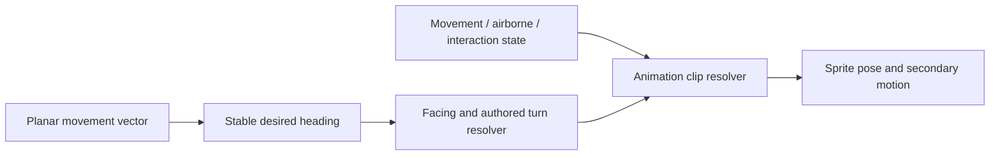
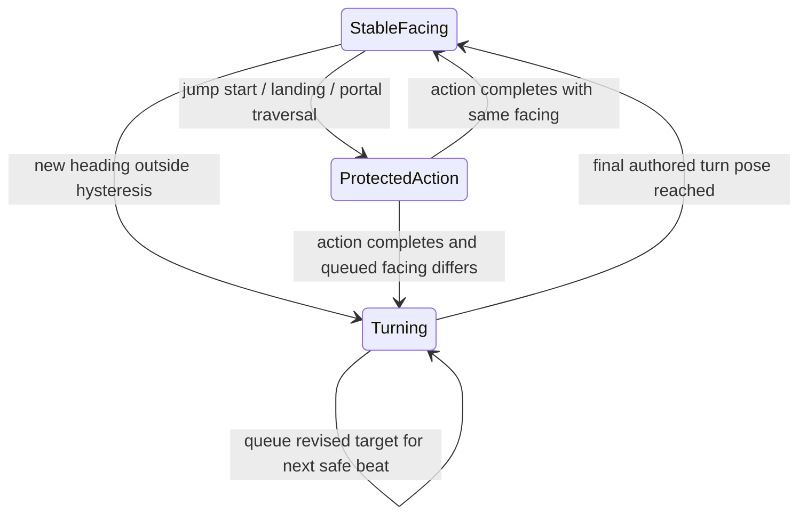

# Rabbit mascot: direction, turning, and hole traversal

**2026-09-24:** the user requested removal of the rabbit. The mascot and portal
interaction are no longer mounted on the landing page. The material below records
the retired prototype and earlier plans.

Current implementation: [living mascot MVP](rabbit-living-mascot.md), authorized
2026-09-23, includes five living actions and reversible, independently movable
vertical screen-facing portals on the existing landing page only. The first pair
is upper A and lower B; page scroll drives a reversible timeline, including
partial progress and reversing during entry/exit. The app tabs were removed at the
user's explicit correction. Pass 04 is the temporary run; further run
refinement is stopped. Full directional runs and arbitrary rotated openings are
still future work. This supersedes the earlier approval order below without
granting final visual approval to the run or turnaround.

## Original staged contract

This is the earlier proposed asset/runtime contract. At that stage work
uses approved [joint guide 04](rabbit-run-joint-guide.md) to review the new
right-facing render 04. The refined proportions and eight-view turnaround remain unchanged
and unapproved. See [the proportion contract](rabbit-character-proportions.md).
Hole traversal was a later, explicitly requested milestone. Do not generate all
directional or hole animation sets before the relevant visual approval.

## Approval order

1. Review the simplified joint guide: complementary 01/05 contacts, connected
   limb chains, stable pelvis and anatomical right watch hand.
2. Render the corrected `run_right`, compare old/new, inspect its seam and
   perform the real world-speed/sliding test. Stop for visual run approval.
3. Freeze the refined eight-view turnaround plus canonical measurements as
   Character Bible v1 after that approval; retain the original as identity check.
4. Prove `idle_breathe`, `idle_look_left`, `idle_look_right`, `idle_watch_check`
   and `crouch`, with convincing `idle -> run -> idle -> crouch` transitions.
   Do not generate every directional run yet.
5. Prove Portal A-to-B: approach A, crouch, enter A, become hidden, transfer,
   exit B and recover. Use independently positioned portal objects and actual
   foreground-rim occlusion.
6. Generalize portal placement and entry/exit headings: left/right, top/bottom,
   arbitrary page positions and framed screens. Expand directional action sets
   only as approved milestones require them.

## Character identity and turnaround

The first frame of `packages/web/design/rabbit-sprite.png` remains the canonical
rendered side seed; `rabbit_1.jpg` supplies the underlying anatomy and costume.
Preserve the head/muzzle, small eye, long ears, limb lengths, coat cut, waistcoat,
striped trousers, large bare rabbit feet, pocket watch, and 1-bit dither.

The source exposes one view. The unseen back and opposite side are proposed
reconstructions, requiring user approval, not observed reference facts. Add no
hat, glasses, belt, backpack, shoes, new markings, or extra accessories.

Proposed handedness convention: the visibly rearward watch-carrying arm in the
right-facing source is the anatomical right arm. Keep that assignment through
all views. In a front view it is on image-left; from the back it is on
image-right. An opposite profile can naturally occlude the far hand/watch. Do not
move the watch to the nearer hand to improve visibility or mirror its dial.

The turnaround uses the same relaxed, alert standing pose, proportions, and
anatomical scale in all four views. Ears maintain their physical length through
perspective. Opposite sides are authored explicitly. Default `mirror_allowed`
is false; a future exception requires a symmetry check and explicit approval.

## Asset naming and registration

All final assets are under `packages/web/design/rabbit-character/`.

| Kind | Contract |
| --- | --- |
| Seed | `character-seed.png`; exact original ink, integer enlargement and padding |
| Current clip | `run_right`; `animations/run_right/frames/01.png` through `08.png` |
| Current strip/preview | `run-strip.png`, `run-preview.gif`, `run-preview.webp` |
| Turnaround | Eight `turnaround/{direction}.png` views; `turnaround-sheet.png` (cardinals), `turnaround-8-view-sheet.png` (all) |
| Cardinal directions | `front`, `back`, `left`, `right` |
| Authored 3/4 views | `front_left`, `front_right`, `back_left`, `back_right`; static only, awaiting approval |
| Locomotion clips | `{action}_{direction}`, e.g. `run_front`, `idle_back`, `run_left` |
| Jump family | `jump_{direction}` selects `jump_start`, `jump_up`, `fall`, `land` clips for that direction |
| Turn clips | `turn_{from}_to_{to}`, e.g. `turn_left_to_front` |
| Portal clips | `{portal_action}_{direction}`; direction is the character's view, not a portal id |

Use a common 512 x 512 transparent canvas, floor y=480, and ground/root anchor
`[256, 480]`. This extra upper padding accommodates the standing ears at the
same head/watch scale as the running figure. Keep
one anatomical scale; do not fit each drawing independently to its visible
bounds. Airborne feet and head bob must remain displaced from the floor. The
run's ink scale is unchanged from its preparation scale; registration changes
are recorded in the manifest. Historical pass 01 remains available for comparison.

The asset manifest records action, facing, frame count, timing, anchor, loop,
approval status, and whether mirroring is permitted. Only genuinely generated
clips appear as available. Planned clip names must not silently resolve to a
flipped `run_right`. Body/collision geometry stays independent of ear, coat, and
foot extents and is never recalculated from the current sprite pixels.

## Facing and animation flow

The vector is movement across the ground/page plane: +x means right, -x left,
+y toward the camera/front, -y away/back. Jump height and vertical velocity are
separate quantities; falling must not select a front-facing view. Actual heading
drives facing, not the last key pressed. This supports keyboard, touch, pointer
destinations, and autonomous approaches through the same interface.

For four directions, select the nearest cardinal heading; retain current facing
on exact diagonal ties. For eight, select the nearest 45-degree direction when
its approved assets exist. Apply a small dead zone and angular hysteresis to
avoid switching repeatedly near sector boundaries. At zero speed retain the last
facing. Do not blend two bitmaps into a transparent double-rabbit silhouette.

Keep three separate pieces of state:

- `movement`: planar velocity, grounded/airborne status, jump height and velocity.
- `facing`: current direction, desired heading, active turn, queued target.
- `action`: idle/run/jump phases or an exclusive interaction such as hole entry.

Animation consumes these states. It does not move the physics body.

Later, a persistent character controller can also retain attention, time since
activity, and the current ambient action across web-app navigation. Breathing,
look-left/right, watch checks, ear flicks and weight shifts select from available
approved clips. Locomotion and committed interactions take priority, with ambient
actions ending or queueing at safe beats. Keep these intentions separate from
sprite playback so mounting a view does not reset the rabbit's entire life/state.
These are compatibility requirements, not implemented behavior in this milestone.

### Authored turning

Connect adjacent cardinal views on a ring: front ↔ right ↔ back ↔ left ↔ front.
Each directed edge needs its own authored turn, or a validated sequence of 3/4
transition poses. Reverse playback is permitted only after checking the weight
shift and ear follow-through; it is not the default. A 180-degree reversal uses
two adjacent turns, choosing the shortest path and retaining the previous turn
sign on a tie.

Proposed initial timing: 3–4 poses over roughly 180–260 ms, tuned by visual
review. Turn in place when stationary. While moving, steer heading and reduce
speed for sharp turns so the feet do not slide sideways under an old pose.
Preserve stance phase across run-direction changes. A new input updates a queued
target instead of restarting the same turn each frame. Jump anticipation,
landing, and portal entry/exit have protected beats. Until airborne turns are
authored, keep takeoff facing through the airborne phase and consume the queued
turn after landing.

## Planned portal milestone

Start with an opening in the page surface: an irregular dark elliptical mouth,
an ink/dither rim, a thicker near lip, and denser stipple inside. Use the landing
page's existing rabbit-hole material as the visual reference. A small contact
shadow grounds paws near the lip. The source/runtime remains 2D or 2.5D.

After the living-character proof, the first portal proof should show approach
to independently placed Portal A, a necessary authored facing turn, crouch,
head-first entry behind its lip, hidden transfer, then emergence from Portal B
and recovery. Entry and exit need distinct poses; exit
is not automatically entry played backward. This is a concept, not a currently
generated or browser-verified portal preview.

### Portal object

| Field | Meaning |
| --- | --- |
| `id`, `enabled` | Stable object identity and availability |
| `destinationPortalId` | Resolve the paired opening independently of either object's page position |
| `surface` | Page, ground/platform, or monitor/screen attachment |
| `position`, `dimensions`, `shape` | Opening geometry in the host's coordinates |
| `surfaceFrame` | Local tangent axes and an inward depth normal |
| `triggerArea`, `approachAnchor` | Nearby approach area and safe alignment point |
| `entryHeading`, `exitHeading`, `exitAnchor` | Local entry/exit directions and recovery location |
| `interior`, `rim`, `foregroundEdge` | Depth artwork and the near lip |
| `apertureMask`, `crossingMask` | Visible opening and front/behind partition |
| `depthProfile`, `shadowProfile` | Restrained scale, darkness, and contact cues |

Map traversal into the portal's local coordinates, not absolute page pixels. A
ground hole uses a different surface frame; a framed monitor attaches the same
frame to its inner screen rectangle. Resizing/repositioning that host updates the
frame and masks together. This keeps later screen entry possible without a new
interaction system.

### Interaction states

```mermaid
stateDiagram-v2
  Locomotion --> ApproachHole: requestEnter(portalId)
  ApproachHole --> Crouch: at approach anchor, slow, correctly facing
  Crouch --> EnterHole: anticipation beat completes
  EnterHole --> HiddenInHole: body fully crosses opening
  HiddenInHole --> Transfer: destination portal B selected and ready
  Transfer --> ExitHole: resolve B surface frame, exit anchor and heading
  ExitHole --> RecoverFromExit: feet/body clear foreground lip
  RecoverFromExit --> Locomotion: recovery completes; idle or run from velocity
  ApproachHole --> Locomotion: cancel before committed entry
```

The interaction owns the approach, alignment, traversal path, and protected
action timing. It uses the same facing resolver and animation registry as
locomotion. Crouch loads the legs and compresses/folds the ears. Entry extends
the body into the opening; ears drag behind acceleration. Exit leads with ears
or head, then the torso, then a visible weight-bearing recovery/landing.

Transfer happens only while hidden. Portal A and B each supply their own surface
frame, masks and entry/exit headings; a screen's edges or a left/right pair must
not be hardcoded into the controller. A missing or disabled destination keeps
the character in a defined hidden/recovery flow instead of revealing it at an
unrelated coordinate. This remains design work, not an implemented runtime.

After committed entry, conflicting movement input queues until a safe exit;
the character cannot flicker back to run midway through occlusion. Disable free
movement/collision participation only after the hidden crossing event; restore
at the defined exit anchor before recovery completes. `hidden_in_hole` is a
semantic state with no visible sprite, not a faded bitmap left on the page.

### Required action concepts

| Action | Purpose |
| --- | --- |
| `crouch` | Gather feet, lower torso, fold ears, shift weight toward opening |
| `enter_hole_start` | Extend out of anticipation and commit head/forebody |
| `enter_hole_mid` | Articulated dive/run pose while body crosses the rim |
| `enter_hole_finish` | Last visible trailing body/ear/foot parts clear the lip |
| `hidden_in_hole` | Invisible interaction state; no generated strip required |
| `exit_hole_start` | First visible ears/head at the aperture |
| `exit_hole_mid` | Pull/step body over the lip with coherent limb support |
| `exit_hole_finish` | Feet and body fully clear the opening |
| `recover_from_exit` / `land_from_exit` | Absorb weight and return to idle/run |
| Optional `peek_out` | Inspect the page before completing emergence |

For the focused proof, author only the crouch, one short entry, one short exit,
and recovery for the selected portal-facing directions. Semantic start/mid/finish
markers can share a single authored traversal strip. Keep the other concepts
planned until the proof is approved.

### Rendering and depth

1. Page/platform/screen surface and far edge of the opening.
2. Hole interior, dark depth texture, and any rear contact shadow.
3. Behind-surface part of rabbit, clipped to the aperture.
4. Depth shading over that behind-surface portion.
5. In-front part of rabbit, using the complementary crossing mask.
6. Foreground rim/near lip, followed by the appropriate contact shadow.

Drive the complementary masks from portal-local traversal progress and authored
pose landmarks. The crossing boundary must visibly travel over the rabbit as
head, torso, hips, and feet pass behind the lip. Preserve a readable partially
occluded pose for several frames. A modest scale reduction can reinforce depth
only after the crossing is underway. Opacity alone or scaling to zero cannot
stand in for entry. On exit, reverse spatial crossing while playing the distinct
emergence poses. Stop drawing the rabbit only when it is fully occluded/hidden.

### Four versus eight directions

Portal geometry, masks, depth progress, and interaction states are independent of
direction count. Four views require alignment to a cardinal entry heading and
authored transition poses for the turn. Eight directions permit oblique approach
and emergence with the nearest approved 3/4 action. A new camera view still needs
its own anatomy/occlusion check; never synthesize the unseen side by mirroring
the asymmetric watch or by rotating a flat side-view bitmap.

### Later proof acceptance

The rabbit slows and loads its weight; the ears react to compression and entry;
the foreground rim visibly hides successive body parts; the interior remains a
stable world opening; exit restores depth in a readable order; recovery completes
before idle/run resumes. Check at least one long partial-entry hold and a slow
playback of exit. Preserve identity throughout. Deliver entry and exit previews
plus browser verification of the actual scene before calling that later milestone
complete. None of those portal assets or runtime behaviors are delivered yet.
